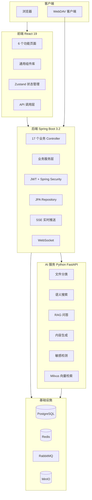

# NebulaMind · 星云智脑

> 面向个人与团队的 AI 知识管理云盘 — 让文件自动整理、语义检索与内容生成

---

## 目录

- [项目简介](#项目简介)
- [产品价值](#产品价值)
- [核心功能](#核心功能)
- [技术架构](#技术架构)
- [系统架构图](#系统架构图)
- [项目管理](#项目管理)
- [快速开始](#快速开始)
- [项目结构](#项目结构)
- [文档体系](#文档体系)
- [后续规划](#后续规划)
- [License](#license)

---

## 项目简介

**NebulaMind** 是面向个人与团队的 AI 智能云盘产品，定位是"从存储工具进化为知识助手"。项目围绕"文件检索难、整理耗时长、内容利用率低、敏感信息管控弱"四个真实痛点，从需求分析、方案设计、迭代开发、测试验收到容器化交付，完整走了一遍产品落地闭环。

产品核心体验是"上传 → 理解 → 检索 → 生成"：用户上传文档后，系统自动完成文件解析、AI 分类打标、摘要生成、向量索引；用户可以用自然语言搜索文件、基于单文档或多文档问答，并直接生成摘要、报告；PPT 大纲与格式转换后端接口已实现，前端页面待接入。安全侧提供敏感内容两级检测、AES-256-GCM 加密和端到端加密；生态侧支持 MinIO/S3、WebDAV 云盘接入。

项目源自学校 5 人课程小组作业，按 Scrum 节奏在 8 周内完成 V1.0-V2.0；本公开仓库为应聘整理的个人完善版，已重构代码并补齐文档。项目采用双服务架构：Java 21 + Spring Boot 3.2 负责业务与安全，Python FastAPI 负责 AI 推理，前端使用 React 19 + TypeScript + Vite；基础设施包括 PostgreSQL、Redis、RabbitMQ、MinIO 与 Milvus，并通过 Docker Compose 统一编排。


## 产品价值

| 维度 | 说明 |
|------|------|
| 目标用户 | 个人知识工作者、研究团队、中小企业文档管理者 |
| 核心场景 | 文档智能管理、语义检索、基于文件的 AI 问答与内容生成 |
| 差异化 | 云盘 + AI 深度融合，非简单的存储 + 外部 AI 拼接 |
| 竞品对标 | Notion AI、阿里云盘智能助手 |

### 应用案例

- **个人知识管理**：上传文档后 AI 自动分类打标，支持语义搜索精准定位，可基于多文件生成读书报告或研究综述
- **文件版本管理**：版本历史与 diff 对比支持修改追踪，敏感内容可自动加密确保合规
- **内容创作者**：基于云盘素材快速生成分析报告；PPT 与格式转换后端接口已实现，前端页面待接入
- **企业文档安全**：两级敏感检测 + 自动加密机制可用于企业内部文档外发前的安全检查

---

## 核心功能

### 文件管理

| 功能 | 描述 |
|------|------|
| 文件上传/下载 | 支持普通文件上传/下载、重复检测；后端已实现分片接口，前端待接入 |
| 文件版本管理 | 版本历史追踪、版本 diff 对比 |
| 智能分类 | AI 自动分类与标签生成 |
| 多存储后端 | 支持 MinIO/S3 对象存储、WebDAV 云盘、本地存储 |

### AI 能力

| 功能 | 描述 |
|------|------|
| 语义搜索 | 基于向量检索的自然语言文件搜索 |
| 文档问答 | 单文档 RAG 问答 + 跨文档联合问答 |
| 内容生成 | 摘要提取、要点提炼、报告生成；PPT 大纲与格式转换接口已实现（前端待接入） |
| 格式转换 | txt/md → docx 等格式互转（后端接口已实现，前端页面待接入） |

### 安全合规

| 功能 | 描述 |
|------|------|
| 敏感内容检测 | 两级检测（正则快速过滤 + LLM 深度分析） |
| 文件加密 | 高风险文件自动 AES-256-GCM 加密 |
| 端到端加密 | 浏览器本地 AES-256-GCM 加密，每个文件独立密钥，密钥仅显示一次 |
| 权限管理 | 后端预留角色校验与管理接口，前端管理页面未开放 |

### 平台特性

- JWT 认证 + Refresh Token 自动续期
- WebSocket 实时通信 / SSE 流式响应
- WebDAV 协议兼容（可作为网络驱动器挂载）
- S3 兼容接口
- Sentinel 限流熔断
- SkyWalking 调用链追踪（预留）
- Docker Compose 开发/生产编排（旧版曾部署至阿里云 ECS；当前公开版本部署待执行）

---

## 技术架构

| 层级 | 技术 | 版本 | 用途 |
|------|------|------|------|
| 前端 | React + TypeScript + Vite | React 19 | 用户界面 |
| 前端 | Zustand | 5.x | 状态管理 |
| 前端 | Tailwind CSS | 3.x | UI 样式 |
| 前端 | Axios | 1.x | HTTP 客户端 |
| 后端 | Spring Boot | 3.2.0 | 业务服务框架 |
| 后端 | Java | 21 | 开发语言 |
| 后端 | Spring Security + JWT | - | 认证授权 |
| 后端 | Spring Data JPA | - | ORM |
| AI 服务 | Python FastAPI | - | AI 推理层 |
| AI 服务 | 自研 RAG（Milvus + Embedding + LLM） | - | 文档问答 |
| 数据库 | PostgreSQL | 15 | 关系型数据库 |
| 缓存 | Redis | 7.x | 缓存与会话 |
| 消息队列 | RabbitMQ | 3.x | 异步任务 |
| 对象存储 | MinIO (S3 兼容) | - | 文件存储 |
| 向量数据库 | Milvus | - | 向量检索 |
| 容器化 | Docker + Docker Compose | - | 部署编排 |
| 反向代理 | Nginx | - | 前端代理 + WebSocket 支持 |

---

## 系统架构图



---

## 项目管理

### 开发流程

项目按照"需求分析 → 方案设计 → 团队分工 → 迭代开发 → 测试验收 → 部署交付"的完整流程推进，各阶段均有文档产出。

```
需求分析 → 方案设计 → 团队分工 → 迭代开发 → 测试验收 → 部署交付
   ↓           ↓           ↓           ↓           ↓           ↓
 需求文档    架构设计     开发方案    代码实现     测试报告    部署指南
```

### 项目里程碑

| 阶段 | 周期 | 交付物 | 说明 |
|------|------|--------|------|
| 需求分析 | W1 | [需求文档](/docs/requirement.md) | 用户画像、用户故事、MoSCoW 优先级、功能模块定义 |
| 架构设计 | W1-W2 | 系统架构设计文档 | 双服务架构、模块划分、技术选型、接口规范 |
| 数据库设计 | W2 | 数据库 ER 图 + DDL 脚本 | 关系模型、索引策略、数据字典 |
| 团队分工 | W2 | 团队开发方案分配 | 5 个角色开发方案、任务分解、交付物定义 |
| 迭代开发 | W3-W6 | 后端 / AI / 前端代码 | V1.0 基础架构 → V1.1 AI 集成 → V1.2 内容生成与安全 |
| 测试验收 | W6-W7 | 验收记录、性能优化报告 | 功能测试、性能压测、安全加固 |
| 部署交付 | W7-W8 | Docker 镜像 + 部署指南 | Docker Compose 编排、ECS 部署方案（当前版本待执行） |

### 团队角色分工

本项目以 Scrum 团队模式运作，涵盖以下角色：

| 角色 | 职责 |
|------|------|
| 架构师/后端负责人 | 系统架构设计、技术选型、后端服务开发 |
| 大模型应用工程师 | AI 服务开发、RAG 策略优化、模型调优 |
| 前端负责人 | 前端框架搭建、页面开发、交互设计 |
| 安全与协作工程师 | 安全加固、敏感检测、加密模块、WebDAV/S3 兼容 |
| 测试与运维工程师 | 测试体系搭建、Docker 容器化、部署运维 |

### 技术选型决策

| 决策 | 选项 | 选择理由 |
|------|------|---------|
| 后端框架 | Spring Boot 3 vs FastAPI 单体 | 业务服务用 Java 21 + Spring Boot 保证工程化与生态成熟度；AI 推理用 Python FastAPI 发挥 LLM 生态优势，双服务解耦 |
| AI 服务框架 | FastAPI vs Flask | FastAPI 原生支持异步、Pydantic 数据校验与 OpenAPI 文档，适合 AI 流式接口 |
| 数据库 | PostgreSQL 15 vs MySQL | 项目涉及全文检索与 JSON 字段，PostgreSQL 对复杂查询与扩展支持更好 |
| 向量数据库 | Milvus vs FAISS 文件索引 | 团队级共享检索需要独立向量库，Milvus 支持水平扩展与元数据过滤 |
| 对象存储 | MinIO (S3) vs 本地磁盘 | 本地开发与生产统一走 S3 协议，MinIO 与主流 S3/WebDAV 云存储兼容 |
| 认证方式 | JWT + Refresh Token vs Session | 前后端分离 + 多服务架构下无状态认证更易扩展 |
| 部署方式 | Docker Compose vs 单机脚本 | 6 个基础设施服务依赖关系复杂，Compose 可一键编排并保证环境一致 |

### 范围管理

采用 MoSCoW 方法进行功能优先级管理（详见 [需求文档](/docs/requirement.md#moscow-优先级矩阵)）：

- **Must Have（必须做）**：用户认证、文件上传/下载、语义搜索、文档问答、智能分类 — 构成 AI 云盘核心闭环
- **Should Have（应该做）**：版本管理、摘要/报告生成、格式转换、权限管理 — 提升知识管理效率
- **Could Have（可以做）**：敏感检测、自动加密、WebDAV、S3 兼容 — V1.2+ 迭代范围
- **Won't Have（本次不做）**：移动端 App、实时协同编辑、云盘互备迁移

### 开发迭代记录

| 迭代 | 内容 | 状态 |
|------|------|------|
| V1.0 | 基础架构搭建、文件管理 CRUD、用户认证 | ✅ 完成 |
| V1.1 | AI 服务集成、语义搜索、文档问答（RAG） | ✅ 完成 |
| V1.2 | 内容生成（摘要/报告/PPT 后端）、敏感检测 | ✅ 后端完成；PPT/格式转换前端待接入 |
| V1.3 | Docker 容器化、性能优化、安全加固 | ✅ 完成 |
| V2.0 | 存储抽象层重构、WebDAV/S3 兼容 | ✅ 完成 |

### 质量保障

- **双服务集成测试**：后端与 AI 服务通过 REST/SSE 契约联调，覆盖上传→索引→检索→问答全链路
- **性能优化**：基于性能测试报告完成缓存策略、限流熔断（Sentinel）、CDN 配置优化
- **安全加固**：JWT + Refresh Token 认证、BCrypt 密码哈希、敏感文件 AES-256-GCM 加密
- **自动化测试**：后端 7 个 JUnit 测试类，覆盖核心服务与安全模块
- **容器化一致性**：Docker Compose 统一开发/生产环境，避免"本地能跑、线上不行"

### 文档管理

| 文档 | 说明 |
|------|------|
| [需求文档](/docs/requirement.md) | 用户画像、用户故事、MoSCoW 优先级 |
| 架构设计文档 | 双服务架构方案、技术选型分析、系统架构图 |
| API 规范文档 | REST API 设计规范、接口定义、数据模型 |
| 数据库设计文档 | ER 图、DDL 脚本、索引策略、种子数据 |
| 部署指南 | Docker 编排、ECS 部署流程、环境变量说明 |

---

## 快速开始

### 前置条件

- Docker & Docker Compose（推荐）
- JDK 21+（本地开发）
- Node.js 18+（本地开发）

### 一键启动（生产编排，需先配置 .env）

```bash
# 克隆项目
git clone https://github.com/YL-snow/NebulaMind.git
cd NebulaMind

# 1. 复制并配置环境变量（MAAS_API_KEY、JWT_SECRET、INTERNAL_API_KEY、BACKEND_API_KEY、数据库密码等）
cp .env.example .env

# 2. 构建并启动全部服务
docker compose -f docker-compose.prod.yml up -d --build
```

服务启动后访问：

| 服务 | 地址 |
|------|------|
| 前端应用 | http://localhost |
| 后端 API | http://localhost:8080 |
| AI 服务 | http://localhost:8081 |
| MinIO 控制台 | http://localhost:9001 |

注意：仓库根目录 `docker-compose.yml` 只编排 PostgreSQL/Redis/RabbitMQ/MinIO/etcd/Milvus 基础设施，不包含应用服务；本地开发请使用 `docker-compose.dev.yml` 启动基础设施，再分别启动后端、前端和 AI 服务。


### 本地开发

```bash
# 1. 启动基础设施
docker compose -f docker-compose.dev.yml up -d

# 2. 启动后端
cd backend
mvn spring-boot:run

# 3. 启动前端（新终端）
cd frontend
pnpm install
pnpm run dev

# 4. 启动 AI 服务
cd ai-services
pip install -r requirements.txt
python main.py
```

### 默认账号

| 角色 | 用户名 | 密码 |
|------|--------|------|
| 管理员 | admin@nebulamind.com | 部署时自行设置（见 .env） |
| 普通用户 | 注册后使用 | - |

---

## 项目结构

```
NebulaMind/
├── backend/                     # Spring Boot 后端服务
│   ├── src/main/java/           # Java 源码（17 个业务 Controller + 全局异常处理器，117 个 Java 文件）
│   ├── src/main/resources/      # 配置文件
│   └── src/test/java/           # 测试代码（7 个 JUnit 测试类）
├── frontend/                    # React 前端应用
│   └── src/
│       ├── pages/               # 6 个功能页面
│       ├── components/          # 通用与业务组件
│       ├── api/                 # API 调用封装
│       ├── stores/              # Zustand 状态管理
│       └── hooks/               # React 自定义 Hooks
├── ai-services/                 # Python AI 推理服务
│   └── app/
│       ├── api/                 # 11 个业务端点 + 5 个辅助端点
│       ├── services/            # 核心 AI 服务
│       ├── core/                # LLM 客户端封装
│       └── workers/             # 异步文件处理器
├── docs/                        # 项目文档
│   ├── architecture/            # 架构设计文档
│   └── database/                # 数据库设计文档
├── deploy/                      # 部署脚本
├── docker-compose.yml           # 基础设施编排（不含应用服务）
├── docker-compose.prod.yml      # 生产环境编排
└── docker-compose.dev.yml       # 本地开发编排
```

---

## 文档体系

以下文档可作为项目完整性的参考：

| 文档 | 位置 | 说明 |
|------|------|------|
| [需求文档](/docs/requirement.md) | docs/requirement.md | 用户画像、用户故事、MoSCoW 优先级 |
| [系统架构设计文档](/docs/architecture/系统架构设计文档.md) | docs/architecture/ | 双服务架构、技术选型、模块设计 |
| [API 规范文档](/docs/architecture/API规范文档.md) | docs/architecture/ | REST API 设计规范、接口定义 |
| [数据库设计文档](/docs/database/数据库ER图文档.md) | docs/database/ | ER 图、表结构、索引策略 |
| [DDL 脚本](/docs/database/DDL脚本.sql) | docs/database/ | PostgreSQL 建表语句 |
| [部署指南](/docs/DEPLOYMENT_GUIDE.md) | docs/ | Docker 部署、ECS 部署、环境变量说明 |
| [核心流程与状态图](/docs/flow-diagrams.md) | docs/flow-diagrams.md | AI 摘要时序图、问答流程、文件状态机、用户交互流程 |
| [方案选型记录](/docs/solution-selection.md) | docs/solution-selection.md | 候选方案、评分表、选型结论 |

---

## 后续规划

| 优先级 | 功能 | 状态 |
|--------|------|------|
| 🔴 高 | 文件分享链接 | 待开发 |
| 🔴 高 | 大文件分片上传（前端支持） | 待开发 |
| 🟡 中 | 移动端适配 | 待开发 |
| 🟡 中 | CI/CD 流水线（GitHub Actions） | 待开发 |
| 🔵 低 | 更多网盘接入（百度网盘等，通过 WebDAV 桥接） | 待接入 |

---

## License

Apache 2.0
