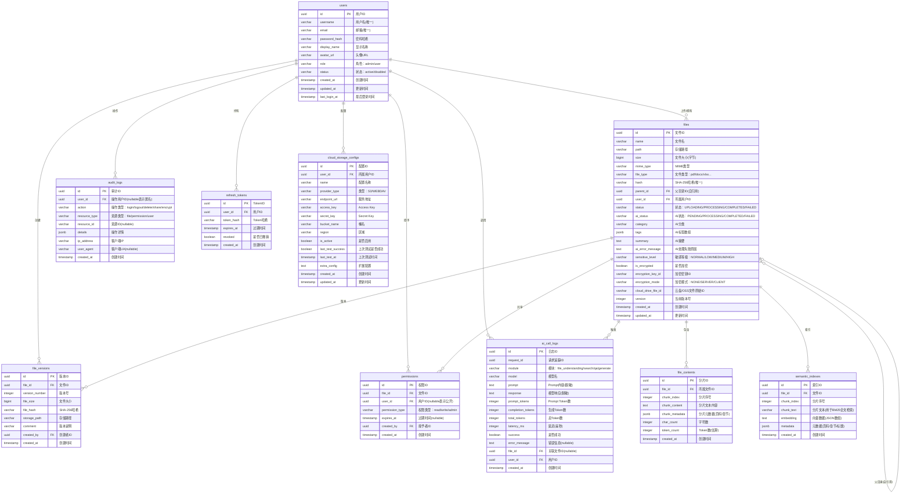

# 数据库ER图文档

**文档版本**：v1.0  
**创建日期**：2026年7月11日  
**所属团队**：云盘智能体开发团队  

---

## 1. ER图总览

### 1.1 实体关系图

### 1.2 实体数量统计

| 表名 | 说明 | 预计数据量 | 保留策略 |
|------|------|-----------|---------|
| users | 用户表 | 100-1000 | 永久 |
| files | 文件表 | 10万-100万 | 永久 |
| file_contents | 文件内容分片表 | 100万-1000万 | 永久 |
| file_versions | 文件版本表 | 50万-500万 | 永久 |
| permissions | 权限表 | 10万-100万 | 永久 |
| semantic_indexes | 语义索引表 | 100万-1000万 | 跟随文件删除 |
| ai_call_logs | AI调用日志表 | 100万-1000万 | 保留90天 |
| audit_logs | 审计日志表 | 10万-100万 | 保留180天 |
| refresh_tokens | 刷新令牌表 | 1万-10万 | 过期自动清理 |
| cloud_storage_configs | 云存储配置表 | 1-50 | 永久 |

---

## 2. 实体详细设计

### 2.1 users（用户表）

| 字段名 | 类型 | 约束 | 说明 |
|--------|------|------|------|
| id | UUID | PK, DEFAULT gen_random_uuid() | 用户ID |
| username | VARCHAR(100) | NOT NULL, UNIQUE | 用户名 |
| email | VARCHAR(255) | NOT NULL, UNIQUE | 邮箱 |
| password_hash | VARCHAR(255) | NOT NULL | 密码哈希(bcrypt) |
| display_name | VARCHAR(100) | NOT NULL | 显示名称 |
| avatar_url | VARCHAR(500) | NULLABLE | 头像URL |
| role | VARCHAR(20) | NOT NULL, DEFAULT 'user' | 角色：admin/user |
| status | VARCHAR(20) | NOT NULL, DEFAULT 'active' | 状态：active/disabled |
| created_at | TIMESTAMPTZ | NOT NULL, DEFAULT NOW() | 创建时间 |
| updated_at | TIMESTAMPTZ | NOT NULL, DEFAULT NOW() | 更新时间 |
| last_login_at | TIMESTAMPTZ | NULLABLE | 最后登录时间 |

**索引**：
- `idx_users_username` ON (username) UNIQUE
- `idx_users_email` ON (email) UNIQUE
- `idx_users_status` ON (status) WHERE status = 'active'

### 2.2 files（文件表）

| 字段名 | 类型 | 约束 | 说明 |
|--------|------|------|------|
| id | UUID | PK, DEFAULT gen_random_uuid() | 文件ID |
| name | VARCHAR(500) | NOT NULL | 文件名 |
| path | VARCHAR(1000) | NOT NULL | MinIO存储路径 |
| size | BIGINT | NOT NULL, DEFAULT 0 | 文件大小(字节) |
| mime_type | VARCHAR(100) | NOT NULL | MIME类型 |
| file_type | VARCHAR(50) | NOT NULL | 文件类型：pdf/docx/xlsx... |
| hash | VARCHAR(64) | NOT NULL | SHA-256哈希 |
| parent_id | UUID | NULLABLE, FK → files.id | 父目录ID |
| user_id | UUID | NOT NULL, FK → users.id | 所属用户 |
| status | VARCHAR(20) | NOT NULL, DEFAULT 'UPLOADING' | 状态 |
| ai_status | VARCHAR(20) | NOT NULL, DEFAULT 'PENDING' | AI状态 |
| category | VARCHAR(100) | NULLABLE | AI分类 |
| tags | JSONB | NULLABLE, DEFAULT '[]' | AI标签数组 |
| summary | TEXT | NULLABLE | AI摘要 |
| ai_error_message | TEXT | NULLABLE | AI处理失败原因 |
| sensitive_level | VARCHAR(20) | NOT NULL, DEFAULT 'NORMAL' | 敏感等级 |
| is_encrypted | BOOLEAN | NOT NULL, DEFAULT FALSE | 是否加密 |
| encryption_key_id | VARCHAR(100) | NULLABLE | 加密密钥ID |
| encryption_mode | VARCHAR(20) | NULLABLE, DEFAULT 'NONE' | 加密模式：NONE/SERVER/CLIENT |
| cloud_drive_file_id | VARCHAR(200) | NULLABLE | 云盘/OSS文件原始ID（S3/WebDAV外部存储） |
| version | INTEGER | NOT NULL, DEFAULT 1 | 当前版本号 |
| created_at | TIMESTAMPTZ | NOT NULL, DEFAULT NOW() | 创建时间 |
| updated_at | TIMESTAMPTZ | NOT NULL, DEFAULT NOW() | 更新时间 |

**索引**：
- `idx_files_user_id` ON (user_id)
- `idx_files_parent_id` ON (parent_id)
- `idx_files_hash` ON (hash)
- `idx_files_status` ON (status)
- `idx_files_ai_status` ON (ai_status)
- `idx_files_category` ON (category)
- `idx_files_created_at` ON (created_at DESC)
- `idx_files_name_gin` ON (name) USING GIN (gin_trgm_ops) — 模糊搜索
- `idx_files_tags_gin` ON (tags) USING GIN — JSONB标签搜索
- `idx_files_sensitive_level` ON (sensitive_level)

### 2.3 file_contents（文件内容分片表）

| 字段名 | 类型 | 约束 | 说明 |
|--------|------|------|------|
| id | UUID | PK, DEFAULT gen_random_uuid() | 分片ID |
| file_id | UUID | NOT NULL, FK → files.id | 所属文件 |
| chunk_index | INTEGER | NOT NULL | 分片序号 |
| chunk_content | TEXT | NOT NULL | 分片文本内容 |
| chunk_metadata | JSONB | NULLABLE, DEFAULT '{}' | 分片元数据 |
| char_count | INTEGER | NOT NULL, DEFAULT 0 | 字符数 |
| token_count | INTEGER | NOT NULL, DEFAULT 0 | Token数(估算) |
| created_at | TIMESTAMPTZ | NOT NULL, DEFAULT NOW() | 创建时间 |

**索引**：
- `idx_file_contents_file_id` ON (file_id)
- `idx_file_contents_file_chunk` UNIQUE ON (file_id, chunk_index)
- `idx_file_contents_fts` ON (chunk_content) USING GIN (gin_tsvector_ops) — **BM25全文检索索引**

### 2.4 file_versions（文件版本表）

| 字段名 | 类型 | 约束 | 说明 |
|--------|------|------|------|
| id | UUID | PK, DEFAULT gen_random_uuid() | 版本ID |
| file_id | UUID | NOT NULL, FK → files.id | 文件ID |
| version_number | INTEGER | NOT NULL | 版本号 |
| file_size | BIGINT | NOT NULL | 文件大小 |
| file_hash | VARCHAR(64) | NOT NULL | SHA-256哈希 |
| storage_path | VARCHAR(1000) | NOT NULL | 存储路径 |
| comment | VARCHAR(500) | NULLABLE | 版本说明 |
| created_by | UUID | NOT NULL, FK → users.id | 创建者 |
| created_at | TIMESTAMPTZ | NOT NULL, DEFAULT NOW() | 创建时间 |

**索引**：
- `idx_file_versions_file_id` ON (file_id)
- `idx_file_versions_file_version` UNIQUE ON (file_id, version_number)
- `idx_file_versions_created_by` ON (created_by)

### 2.5 permissions（权限表）

| 字段名 | 类型 | 约束 | 说明 |
|--------|------|------|------|
| id | UUID | PK, DEFAULT gen_random_uuid() | 权限ID |
| file_id | UUID | NOT NULL, FK → files.id | 文件ID |
| user_id | UUID | NULLABLE, FK → users.id | 用户ID(null=公开) |
| permission_type | VARCHAR(20) | NOT NULL | 权限类型：read/write/admin |
| expires_at | TIMESTAMPTZ | NULLABLE | 过期时间 |
| created_by | UUID | NOT NULL, FK → users.id | 授予者 |
| created_at | TIMESTAMPTZ | NOT NULL, DEFAULT NOW() | 创建时间 |

**索引**：
- `idx_permissions_file_id` ON (file_id)
- `idx_permissions_user_id` ON (user_id)
- `idx_permissions_file_user_type` UNIQUE ON (file_id, user_id, permission_type) WHERE user_id IS NOT NULL
- `idx_permissions_expires_at` ON (expires_at) WHERE expires_at IS NOT NULL

> 实现状态：该表已包含在 DDL 与种子数据中；Java 后端当前未实现 Permission 实体与共享/权限接口，属权限管理规划预留。

### 2.6 semantic_indexes（语义索引表）

| 字段名 | 类型 | 约束 | 说明 |
|--------|------|------|------|
| id | UUID | PK, DEFAULT gen_random_uuid() | 索引ID |
| file_id | UUID | NOT NULL, FK → files.id | 文件ID |
| chunk_index | INTEGER | NOT NULL | 分片序号 |
| chunk_text | TEXT | NOT NULL | 分片文本(用于BM25全文检索) |
| embedding | TEXT | NULLABLE | 向量数据(JSON数组) |
| metadata | JSONB | NULLABLE, DEFAULT '{}' | 元数据 |
| created_at | TIMESTAMPTZ | NOT NULL, DEFAULT NOW() | 创建时间 |

**索引**：
- `idx_semantic_indexes_file_id` ON (file_id)
- `idx_semantic_indexes_file_chunk` UNIQUE ON (file_id, chunk_index)
- `idx_semantic_indexes_fts` ON (chunk_text) USING GIN (gin_tsvector_ops) — **BM25全文检索**
- `idx_semantic_indexes_metadata_gin` ON (metadata) USING GIN

### 2.7 ai_call_logs（AI调用日志表）

| 字段名 | 类型 | 约束 | 说明 |
|--------|------|------|------|
| id | UUID | PK, DEFAULT gen_random_uuid() | 日志ID |
| request_id | UUID | NOT NULL | 请求追踪ID |
| module | VARCHAR(50) | NOT NULL | 模块 |
| model | VARCHAR(100) | NOT NULL | 模型名 |
| prompt | TEXT | NULLABLE | Prompt(脱敏后) |
| response | TEXT | NULLABLE | 响应(脱敏后) |
| prompt_tokens | INTEGER | NOT NULL, DEFAULT 0 | Prompt Token数 |
| completion_tokens | INTEGER | NOT NULL, DEFAULT 0 | 生成Token数 |
| total_tokens | INTEGER | NOT NULL, DEFAULT 0 | 总Token数 |
| latency_ms | INTEGER | NOT NULL, DEFAULT 0 | 延迟(毫秒) |
| success | BOOLEAN | NOT NULL, DEFAULT TRUE | 是否成功 |
| error_message | TEXT | NULLABLE | 错误信息 |
| file_id | UUID | NULLABLE, FK → files.id | 关联文件 |
| user_id | UUID | NOT NULL, FK → users.id | 调用用户 |
| created_at | TIMESTAMPTZ | NOT NULL, DEFAULT NOW() | 创建时间 |

**索引**：
- `idx_ai_call_logs_request_id` ON (request_id)
- `idx_ai_call_logs_module` ON (module)
- `idx_ai_call_logs_model` ON (model)
- `idx_ai_call_logs_user_id` ON (user_id)
- `idx_ai_call_logs_file_id` ON (file_id)
- `idx_ai_call_logs_created_at` ON (created_at DESC)
- `idx_ai_call_logs_success` ON (success) WHERE success = FALSE

### 2.8 audit_logs（审计日志表）

| 字段名 | 类型 | 约束 | 说明 |
|--------|------|------|------|
| id | UUID | PK, DEFAULT gen_random_uuid() | 审计ID |
| user_id | UUID | NULLABLE, FK → users.id | 操作用户(null=匿名) |
| action | VARCHAR(50) | NOT NULL | 操作类型 |
| resource_type | VARCHAR(50) | NOT NULL | 资源类型 |
| resource_id | VARCHAR(100) | NULLABLE | 资源ID |
| details | JSONB | NULLABLE, DEFAULT '{}' | 操作详情 |
| ip_address | VARCHAR(45) | NOT NULL | 客户端IP(支持IPv6) |
| user_agent | TEXT | NULLABLE | 客户端UA |
| created_at | TIMESTAMPTZ | NOT NULL, DEFAULT NOW() | 创建时间 |

**索引**：
- `idx_audit_logs_user_id` ON (user_id)
- `idx_audit_logs_action` ON (action)
- `idx_audit_logs_resource_type` ON (resource_type)
- `idx_audit_logs_created_at` ON (created_at DESC)
- `idx_audit_logs_action_time` ON (action, created_at DESC)

### 2.9 refresh_tokens（刷新令牌表）

| 字段名 | 类型 | 约束 | 说明 |
|--------|------|------|------|
| id | UUID | PK, DEFAULT gen_random_uuid() | TokenID |
| user_id | UUID | NOT NULL, FK → users.id | 用户ID |
| token_hash | VARCHAR(255) | NOT NULL | Token哈希(SHA-256) |
| expires_at | TIMESTAMPTZ | NOT NULL | 过期时间 |
| revoked | BOOLEAN | NOT NULL, DEFAULT FALSE | 是否已撤销 |
| created_at | TIMESTAMPTZ | NOT NULL, DEFAULT NOW() | 创建时间 |

**索引**：
- `idx_refresh_tokens_user_id` ON (user_id)
- `idx_refresh_tokens_hash` ON (token_hash) UNIQUE
- `idx_refresh_tokens_expires_at` ON (expires_at) WHERE revoked = FALSE

### 2.10 cloud_storage_configs（云存储配置表）

| 字段名 | 类型 | 约束 | 说明 |
|--------|------|------|------|
| id | UUID | PK, DEFAULT gen_random_uuid() | 配置ID |
| user_id | UUID | NOT NULL, FK → users.id | 所属用户 |
| name | VARCHAR(100) | NOT NULL | 配置名称 |
| provider_type | VARCHAR(20) | NOT NULL | 类型：S3/WEBDAV |
| endpoint_url | VARCHAR(500) | NULLABLE | 服务地址 |
| access_key | VARCHAR(256) | NULLABLE | Access Key |
| secret_key | VARCHAR(512) | NULLABLE | Secret Key（服务端加密存储） |
| bucket_name | VARCHAR(100) | NULLABLE | 桶名 |
| region | VARCHAR(50) | NULLABLE | 区域 |
| is_active | BOOLEAN | NOT NULL, DEFAULT FALSE | 是否启用 |
| last_test_success | BOOLEAN | NULLABLE | 上次测试是否成功 |
| last_test_at | TIMESTAMPTZ | NULLABLE | 上次测试时间 |
| extra_config | TEXT | NULLABLE | 扩展配置 |
| created_at | TIMESTAMPTZ | NOT NULL, DEFAULT NOW() | 创建时间 |
| updated_at | TIMESTAMPTZ | NOT NULL, DEFAULT NOW() | 更新时间 |

**索引**：
- `idx_cloud_storage_user_id` ON (user_id)
- `idx_cloud_storage_provider` ON (provider_type)
- `idx_cloud_storage_user_provider_name` UNIQUE ON (user_id, provider_type, name)

---

## 3. 外键关系

| 外键 | 源表 | 目标表 | 删除规则 | 说明 |
|------|------|--------|---------|------|
| fk_files_parent | files.parent_id | files.id | SET NULL | 删除目录时，子文件设空 |
| fk_files_user | files.user_id | users.id | CASCADE | 删除用户时，文件级联删除 |
| fk_file_contents_file | file_contents.file_id | files.id | CASCADE | 删除文件时，内容级联删除 |
| fk_file_versions_file | file_versions.file_id | files.id | CASCADE | 删除文件时，版本级联删除 |
| fk_file_versions_user | file_versions.created_by | users.id | RESTRICT | 禁止删除有版本记录的用户 |
| fk_permissions_file | permissions.file_id | files.id | CASCADE | 删除文件时，权限级联删除 |
| fk_permissions_user | permissions.user_id | users.id | SET NULL | 删除用户时，权限设空 |
| fk_permissions_creator | permissions.created_by | users.id | RESTRICT | 禁止删除有授予记录的用户 |
| fk_semantic_indexes_file | semantic_indexes.file_id | files.id | CASCADE | 删除文件时，索引级联删除 |
| fk_ai_call_logs_file | ai_call_logs.file_id | files.id | SET NULL | 删除文件时，日志保留 |
| fk_ai_call_logs_user | ai_call_logs.user_id | users.id | RESTRICT | 禁止删除有调用记录的用户 |
| fk_audit_logs_user | audit_logs.user_id | users.id | SET NULL | 删除用户时，审计记录保留 |
| fk_refresh_tokens_user | refresh_tokens.user_id | users.id | CASCADE | 删除用户时，Token级联删除 |
| fk_cloud_storage_user | cloud_storage_configs.user_id | users.id | CASCADE | 删除用户时，云存储配置级联删除 |

---

## 4. 相关文档

| 文档 | 说明 |
|------|------|
| [DDL脚本.sql](DDL脚本.sql) | 数据库建表脚本 |
| [索引策略文档.md](索引策略文档.md) | 索引策略详细说明 |
| [系统架构设计文档.md](../architecture/系统架构设计文档.md) | 系统架构整体设计 |
| [API规范文档.md](../architecture/API规范文档.md) | API接口规范 |
