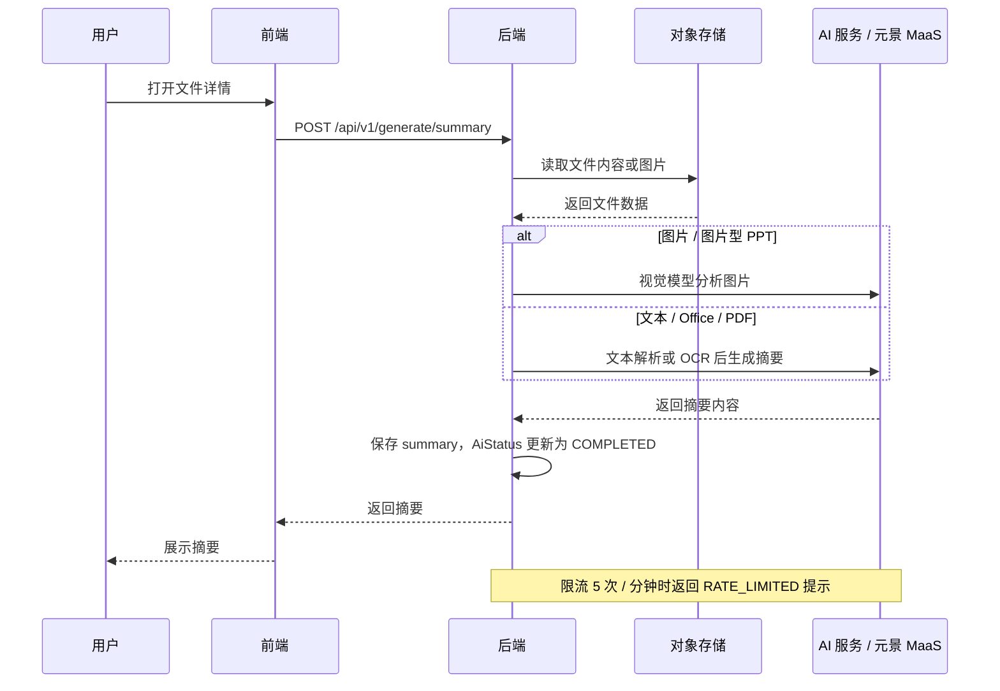
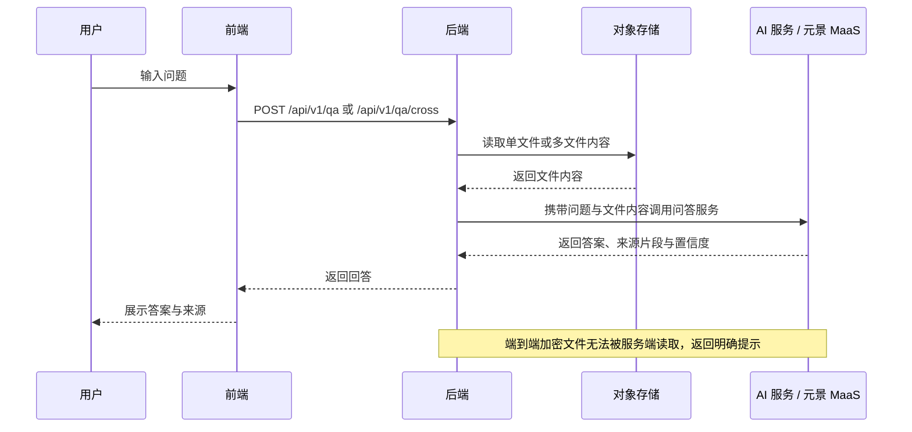
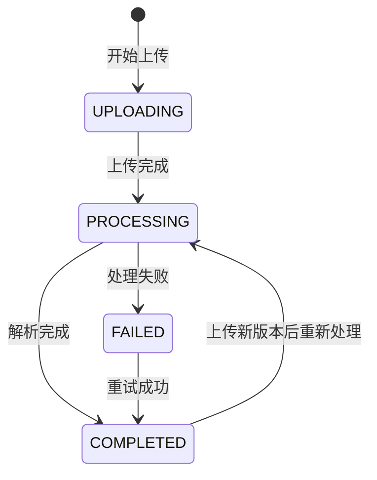
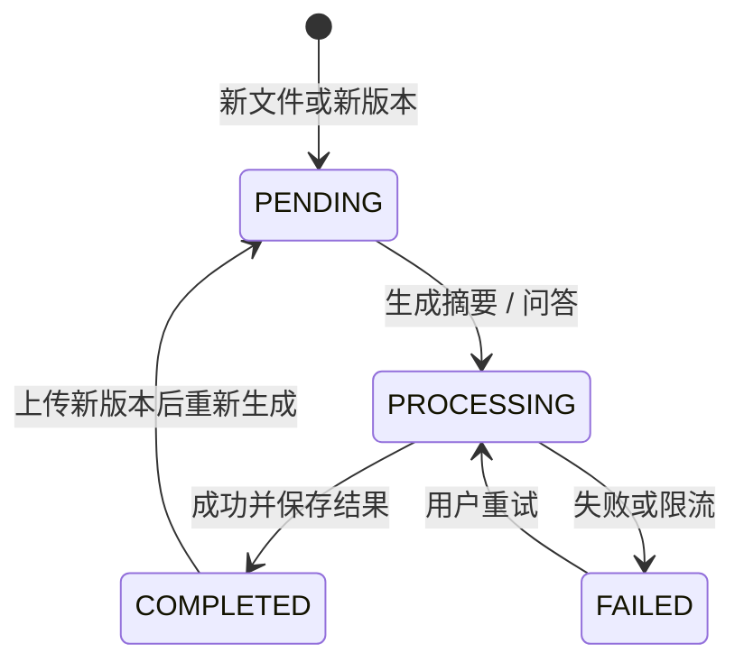
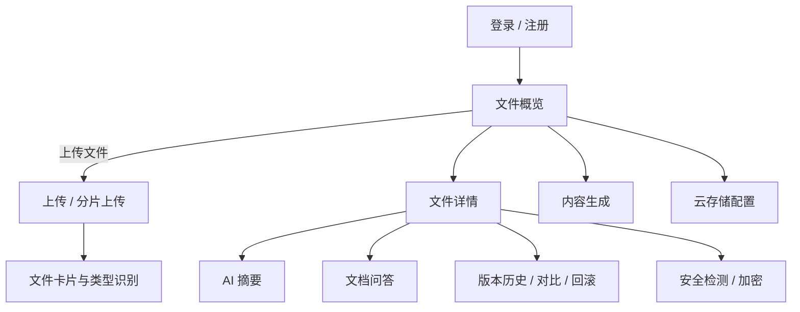

# 核心流程与状态图

本文用图说明 NebulaMind 的 AI 摘要、文档问答、文件版本状态与用户交互流程。

## 1. AI 摘要时序图

## 2. 文档问答 / 检索时序图

## 3. 文件处理状态机

文件上传与解析状态：

AI 处理状态：

## 4. 用户交互流程

核心页面：文件概览、文件详情、内容生成、安全管理、云存储配置。用户上传文件后可进入文件详情完成摘要、问答、版本管理和安全操作。
