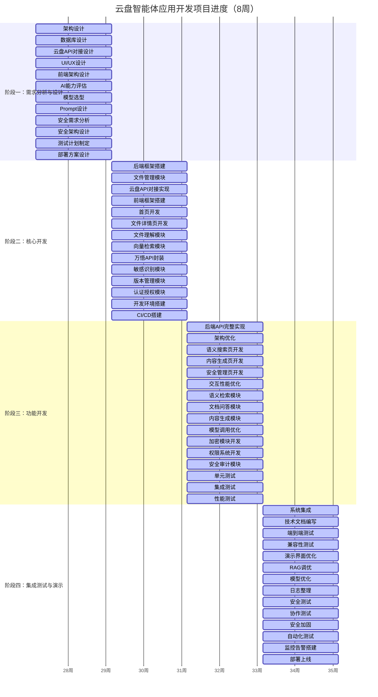
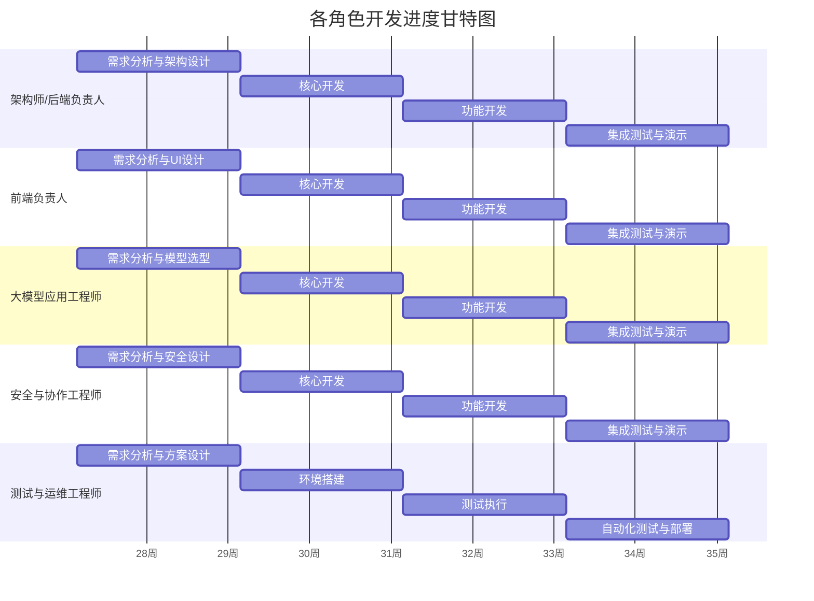
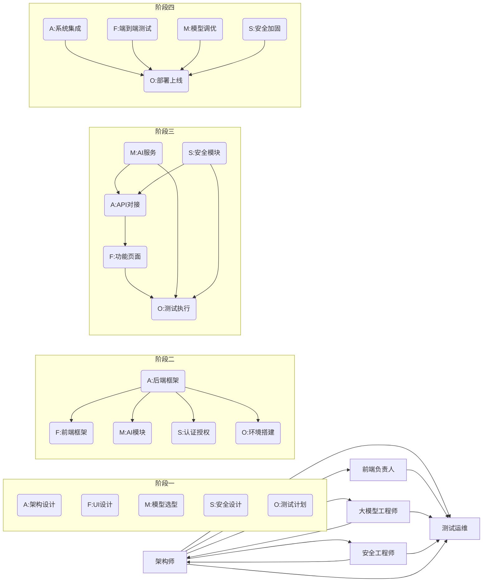

# 云盘智能体应用 - 团队开发方案分配

**文档版本**：v1.0  
**创建日期**：2026年7月10日  
**团队**：云盘智能体开发团队（5人）

---

## 目录

1. [架构师/后端负责人开发方案](#一架构师后端负责人开发方案)
2. [前端负责人开发方案](#二前端负责人开发方案)
3. [大模型应用工程师开发方案](#三大模型应用工程师开发方案)
4. [安全与协作工程师开发方案](#四安全与协作工程师开发方案)
5. [测试与运维工程师开发方案](#五测试与运维工程师开发方案)

---

## 一、架构师/后端负责人开发方案

### 1.1 角色定位

**职责领域**：系统架构设计、核心模块开发、云盘API对接、后端服务开发  
**技术栈**：Java/Python, Spring Boot, PostgreSQL, Redis, RabbitMQ, MinIO  
**AI工具策略**：AI辅助架构设计、代码生成、API文档解析

### 1.2 开发任务分解

#### 阶段一：需求分析与架构设计（W1-W2）

**任务1：系统架构设计**
- **要做什么**：设计整体系统架构，定义模块边界和接口规范
- **怎么做**：
  1. 分析技术方案文档中的架构图和核心模块设计
  2. 使用AI辅助生成架构设计文档，包括组件图、时序图、数据流图
  3. 设计微服务划分：文件服务、检索服务、生成服务、安全服务
  4. 定义服务间通信协议（REST API + 消息队列）
  5. 确定技术选型并编写技术选型文档
- **交付物**：系统架构设计文档、微服务划分方案、技术选型文档

**任务2：数据库设计**
- **要做什么**：设计PostgreSQL数据库表结构和索引策略
- **怎么做**：
  1. 根据技术方案中的数据模型设计数据库表
  2. 设计文件表、用户表、权限表、版本表、日志表
  3. 设计索引策略优化查询性能
  4. 使用AI辅助生成ER图和DDL脚本
- **交付物**：数据库ER图、DDL脚本、索引策略文档

**任务3：云盘API对接方案设计**
- **要做什么**：设计联通云盘API和主流云存储协议的对接方案
- **怎么做**：
  1. 分析联通云盘API文档，设计认证流程和接口封装
  2. 设计WebDAV/S3协议兼容层架构
  3. 设计文件同步机制（增量同步+Webhook）
  4. 使用AI辅助解析API文档并生成接口调用代码
- **交付物**：云盘API对接设计文档、协议兼容层设计

#### 阶段二：核心开发（W3-W4）

**任务4：后端服务框架搭建**
- **要做什么**：搭建Spring Boot后端服务框架
- **怎么做**：
  1. 创建Spring Boot项目，配置依赖（Spring Security, Spring Data JPA, Spring AMQP）
  2. 实现JWT认证和RBAC授权框架
  3. 配置Redis缓存和RabbitMQ消息队列
  4. 实现全局异常处理和日志记录
  5. 使用AI辅助生成项目骨架代码
- **交付物**：后端服务基础框架、认证授权模块

**任务5：文件管理模块开发**
- **要做什么**：实现文件上传、下载、管理的核心API
- **怎么做**：
  1. 实现文件上传接口（支持分片上传）
  2. 实现文件存储到MinIO，记录元数据到PostgreSQL
  3. 实现文件列表、详情、删除接口
  4. 实现文件哈希计算（SHA-256）用于重复检测
  5. 实现异步处理文件（消息队列）
- **交付物**：文件管理API（CRUD）、MinIO存储集成

**任务6：云盘API对接实现**
- **要做什么**：实现联通云盘API和WebDAV/S3协议对接
- **怎么做**：
  1. 实现联通云盘OAuth2认证流程
  2. 封装云盘文件列表、上传、下载API
  3. 实现文件增量同步机制
  4. 实现WebDAV协议兼容层（支持PROPFIND, GET, PUT, DELETE）
  5. 实现S3协议兼容层（支持ListObjects, GetObject, PutObject）
- **交付物**：云盘API客户端、协议兼容层、文件同步服务

#### 阶段三：功能开发（W5-W6）

**任务7：后端API完整实现**
- **要做什么**：实现所有业务API接口
- **怎么做**：
  1. 实现智能分类接口（调用大模型服务）
  2. 实现重复检测接口（基于文件哈希和内容相似度）
  3. 实现语义搜索接口（调用向量检索服务）
  4. 实现文档问答接口（调用大模型服务）
  5. 实现内容生成接口（摘要、报告、PPT）
  6. 使用AI辅助生成API实现代码和单元测试
- **交付物**：完整后端API实现、单元测试用例

**任务8：架构优化与性能调优**
- **要做什么**：优化系统架构和性能
- **怎么做**：
  1. 实现数据库读写分离（如果需要）
  2. 优化查询性能（索引优化、查询缓存）
  3. 实现接口限流和熔断（使用Sentinel/Hystrix）
  4. 优化文件上传下载速度（CDN加速、分片传输）
- **交付物**：性能优化报告、限流熔断配置

#### 阶段四：集成测试与演示（W7-W8）

**任务9：系统集成**
- **要做什么**：整合所有模块，确保端到端流程畅通
- **怎么做**：
  1. 整合前端、后端、AI服务、数据库
  2. 调试接口联调问题
  3. 测试文件上传→AI处理→向量索引→检索的完整流程
- **交付物**：系统集成测试报告

**任务10：技术文档编写**
- **要做什么**：编写完整的技术文档和接口文档
- **怎么做**：
  1. 编写后端API接口文档（使用Swagger/OpenAPI）
  2. 编写系统架构文档
  3. 编写部署指南
  4. 使用AI辅助生成文档内容
- **交付物**：技术方案文档、API接口文档、部署指南

### 1.3 AI工具使用清单

| AI工具 | 使用场景 | 使用方式 |
|-------|---------|---------|
| GitHub Copilot | 代码生成 | 在IDE中实时补全代码 |
| ChatGPT/Claude | 架构设计 | 辅助生成架构图和设计文档 |
| API文档解析工具 | API对接 | 辅助解析联通云盘API文档 |
| 代码审查AI | 代码质量 | 预审查PR代码 |
| 文档生成AI | 技术文档 | 辅助生成技术文档和接口文档 |

---

## 二、前端负责人开发方案

### 2.1 角色定位

**职责领域**：交互界面设计、用户体验优化、前端页面开发  
**技术栈**：React 18, TypeScript, Tailwind CSS, Redux/Zustand, Axios  
**AI工具策略**：AI辅助UI设计、组件生成、代码审查

### 2.2 开发任务分解

#### 阶段一：需求分析与UI设计（W1-W2）

**任务1：UI/UX设计**
- **要做什么**：设计系统界面和交互流程
- **怎么做**：
  1. 根据技术方案中的原型线框图设计UI
  2. 设计色彩方案、字体规范、图标系统
  3. 设计响应式布局（桌面端+移动端）
  4. 使用AI辅助生成UI设计稿和组件配色方案
- **交付物**：UI设计稿、设计规范文档

**任务2：前端架构设计**
- **要做什么**：设计前端技术架构和组件划分
- **怎么做**：
  1. 设计组件层级结构（原子设计）
  2. 设计状态管理方案（Zustand）
  3. 设计API请求封装（Axios）
  4. 设计路由结构和页面划分
- **交付物**：前端架构文档、组件划分方案

**任务3：组件库设计**
- **要做什么**：设计可复用的UI组件库
- **怎么做**：
  1. 设计基础组件：Button, Input, Card, Modal, Table
  2. 设计业务组件：FileCard, SearchBox, ProgressBar
  3. 使用AI辅助生成组件代码和样式
- **交付物**：组件库设计文档

#### 阶段二：核心开发（W3-W4）

**任务4：前端项目框架搭建**
- **要做什么**：搭建React前端项目框架
- **怎么做**：
  1. 使用Vite创建React+TypeScript项目
  2. 配置Tailwind CSS 3.x
  3. 配置Zustand状态管理
  4. 配置路由（React Router）
  5. 封装Axios请求（拦截器、错误处理）
  6. 使用AI辅助生成项目骨架代码
- **交付物**：前端项目基础框架

**任务5：首页（文件概览）开发**
- **要做什么**：实现首页文件概览界面
- **怎么做**：
  1. 实现存储概览卡片（已用空间/总空间）
  2. 实现文件分类统计卡片
  3. 实现智能推荐区域（今日待办、重要文件）
  4. 实现文件列表（支持网格/列表视图切换）
  5. 实现搜索框（支持智能搜索）
- **交付物**：首页界面

**任务6：文件详情页开发**
- **要做什么**：实现文件详情页面
- **怎么做**：
  1. 实现文件信息展示（名称、大小、类型、创建时间）
  2. 实现AI分析结果展示（标签、分类、敏感级别）
  3. 实现智能摘要展示
  4. 实现文档问答区域
  5. 实现版本历史展示
  6. 实现操作按钮（下载、分享、删除）
- **交付物**：文件详情页

#### 阶段三：功能开发（W5-W6）

**任务7：语义搜索页开发**
- **要做什么**：实现智能搜索页面
- **怎么做**：
  1. 实现自然语言搜索输入框
  2. 实现搜索历史记录
  3. 实现搜索结果展示（匹配度、摘要预览）
  4. 实现搜索过滤（文件类型、时间范围）
- **交付物**：语义搜索页

**任务8：内容生成页开发**
- **要做什么**：实现智能内容生成页面
- **怎么做**：
  1. 实现生成功能选择（摘要、内容提炼、报告、PPT）
  2. 实现文件选择器（多选）
  3. 实现生成参数配置（类型、风格）
  4. 实现生成进度展示
  5. 实现生成结果预览和下载
- **交付物**：内容生成页

**任务9：安全管理页开发**
- **要做什么**：实现安全管理页面
- **怎么做**：
  1. 实现敏感文件列表（标记敏感级别）
  2. 实现安全设置选项（自动检测、二次验证、告警）
  3. 实现加密文件管理
  4. 实现权限设置
- **交付物**：安全管理页

**任务10：交互优化与性能优化**
- **要做什么**：优化用户交互和页面性能
- **怎么做**：
  1. 实现文件上传进度条
  2. 实现加载动画和骨架屏
  3. 实现图片懒加载
  4. 优化首屏加载速度（代码分割、资源压缩）
  5. 使用AI辅助生成性能优化建议
- **交付物**：性能优化报告

#### 阶段四：集成测试与演示（W7-W8）

**任务11：端到端测试**
- **要做什么**：测试前端与后端的集成
- **怎么做**：
  1. 测试所有API接口调用
  2. 测试文件上传/下载流程
  3. 测试搜索/问答功能
  4. 测试安全功能（加密、权限）
- **交付物**：端到端测试报告

**任务12：兼容性测试**
- **要做什么**：测试多浏览器和设备兼容性
- **怎么做**：
  1. 测试Chrome、Firefox、Safari、Edge
  2. 测试桌面端和移动端
  3. 测试不同屏幕分辨率
- **交付物**：兼容性测试报告

**任务13：演示界面优化**
- **要做什么**：优化演示界面和视觉效果
- **怎么做**：
  1. 优化首页展示效果
  2. 添加演示引导动画
  3. 优化配色和字体
  4. 确保界面美观大方
- **交付物**：演示版本前端代码

### 2.3 AI工具使用清单

| AI工具 | 使用场景 | 使用方式 |
|-------|---------|---------|
| GitHub Copilot | 代码生成 | 在IDE中实时补全代码 |
| AI设计工具 | UI设计 | 生成配色方案、图标建议 |
| 组件生成AI | 组件开发 | 辅助生成UI组件代码 |
| 代码审查AI | 代码质量 | 预审查PR代码 |
| 性能分析AI | 性能优化 | 辅助分析性能瓶颈 |

---

## 三、大模型应用工程师开发方案

### 3.1 角色定位

**职责领域**：文件理解、语义检索、内容生成模块、RAG实现  
**技术栈**：Python, LangChain, Milvus, 联通万悟大模型API  
**AI工具策略**：AI辅助Prompt设计、模型调优、RAG实现

### 3.2 开发任务分解

#### 阶段一：需求分析与模型选型（W1-W2）

**任务1：AI能力评估**
- **要做什么**：评估联通万悟大模型的能力和适用场景
- **怎么做**：
  1. 测试万悟大模型的文本理解、生成、问答能力
  2. 评估万悟Embedding模型的语义相似度效果
  3. 评估Reranker模型的重排序效果
  4. 编写能力评估报告
- **交付物**：AI能力评估报告

**任务2：模型选型与配置**
- **要做什么**：确定各模块使用的模型和参数配置
- **怎么做**：
  1. 选择文件理解模型（wanwu-llm-pro）
  2. 选择Embedding模型（wanwu-embedding-v1）
  3. 选择Reranker模型（wanwu-reranker-v1）
  4. 配置模型参数（temperature, max_tokens等）
- **交付物**：模型选型文档、参数配置表

**任务3：Prompt模板设计**
- **要做什么**：设计各模块的Prompt模板
- **怎么做**：
  1. 设计文件标签生成Prompt
  2. 设计文档摘要生成Prompt
  3. 设计敏感信息检测Prompt
  4. 设计文档问答Prompt
  5. 设计报告生成Prompt
  6. 使用AI辅助优化Prompt（CoT提示、Few-shot示例）
- **交付物**：Prompt模板库、Prompt优化文档

#### 阶段二：核心开发（W3-W4）

**任务4：文件理解模块开发**
- **要做什么**：实现文件内容理解和分析能力
- **怎么做**：
  1. 实现文件解析器（支持PDF/Word/Excel/图片）
  2. 实现OCR识别（使用Tesseract或万悟多模态模型）
  3. 实现文本分类（LLM文本分类）
  4. 实现标签生成（LLM关键词提取）
  5. 实现摘要生成（LLM文本摘要）
  6. 实现Prompt注入防护（分隔符隔离、内容转义）
- **交付物**：文件理解引擎、OCR识别模块

**任务5：向量检索模块开发**
- **要做什么**：实现语义检索的向量存储和检索能力
- **怎么做**：
  1. 搭建Milvus向量数据库
  2. 实现文档分块策略（语义分块+固定长度约束）
  3. 实现Embedding生成（调用万悟Embedding API）
  4. 实现向量索引构建和查询
  5. 实现混合检索（BM25+向量）
- **交付物**：向量检索引擎、文档分块模块

**任务6：万悟大模型API封装**
- **要做什么**：封装万悟大模型API调用
- **怎么做**：
  1. 封装LLM调用接口（chat/completions）
  2. 封装Embedding调用接口
  3. 封装Reranker调用接口
  4. 实现请求重试和错误处理
  5. 实现API调用日志记录
- **交付物**：大模型API客户端、调用日志模块

#### 阶段三：功能开发（W5-W6）

**任务7：语义检索模块开发**
- **要做什么**：实现完整的语义检索功能
- **怎么做**：
  1. 实现查询理解（LLM意图识别）
  2. 实现向量检索（Milvus查询）
  3. 实现BM25检索（PostgreSQL全文检索）
  4. 实现结果重排序（Reranker模型）
  5. 实现搜索结果聚合和展示
- **交付物**：语义检索服务

**任务8：文档问答模块开发**
- **要做什么**：实现基于文档内容的问答能力
- **怎么做**：
  1. 实现RAG架构（检索增强生成）
  2. 实现上下文构建（从检索结果构建Prompt上下文）
  3. 实现答案生成（LLM阅读理解）
  4. 实现跨文件问答（多文档信息整合）
  5. 实现答案引用标注（标注答案来源）
- **交付物**：文档问答引擎、RAG实现

**任务9：内容生成模块开发**
- **要做什么**：实现文档处理和内容生成能力
- **怎么做**：
  1. 实现长文档摘要生成
  2. 实现内容提炼（关键信息提取）
  3. 实现报告生成（基于云盘素材）
  4. 实现PPT生成（基于模板）
  5. 实现格式转换（PDF/Word/Markdown）
- **交付物**：内容生成服务

**任务10：模型调用优化**
- **要做什么**：优化模型调用性能和成本
- **怎么做**：
  1. 实现Embedding缓存（Redis）
  2. 实现相同查询结果缓存
  3. 实现流式响应（提升用户体验）
  4. 实现模型动态选择（简单任务用轻量模型）
  5. 使用AI辅助分析调用成本和性能
- **交付物**：性能优化报告、缓存策略文档

#### 阶段四：集成测试与演示（W7-W8）

**任务11：RAG调优**
- **要做什么**：调优RAG系统的问答准确率
- **怎么做**：
  1. 收集测试数据集（问题-答案对）
  2. 评估问答准确率
  3. 优化Prompt模板
  4. 优化检索参数（召回数、重排序策略）
  5. 迭代调优直到达到目标（>85%准确率）
- **交付物**：RAG调优报告、测试数据集

**任务12：模型优化**
- **要做什么**：优化各模块模型调用效果
- **怎么做**：
  1. 优化标签生成质量
  2. 优化摘要生成质量
  3. 优化敏感信息检测准确率
  4. 优化报告生成质量
- **交付物**：模型优化报告

**任务13：模型调用日志整理**
- **要做什么**：整理完整的模型调用日志供评审
- **怎么做**：
  1. 导出模型调用日志（JSON格式）
  2. 统计调用频率、成本、成功率
  3. 编写日志分析报告
- **交付物**：模型调用日志文件、日志分析报告

### 3.3 AI工具使用清单

| AI工具 | 使用场景 | 使用方式 |
|-------|---------|---------|
| GitHub Copilot | 代码生成 | 在IDE中实时补全代码 |
| Prompt优化AI | Prompt设计 | 辅助设计和优化Prompt模板 |
| 模型评估AI | 模型调优 | 辅助评估模型效果 |
| LangChain文档AI | RAG实现 | 辅助理解LangChain用法 |
| 代码审查AI | 代码质量 | 预审查PR代码 |

---

## 四、安全与协作工程师开发方案

### 4.1 角色定位

**职责领域**：安全管控、敏感识别、加密模块、协作功能开发  
**技术栈**：Java/Python, Cryptography, Spring Security, PostgreSQL  
**AI工具策略**：AI辅助安全审计、漏洞检测、权限策略设计

### 4.2 开发任务分解

#### 阶段一：需求分析与安全架构设计（W1-W2）

**任务1：安全需求分析**
- **要做什么**：分析系统安全需求和风险点
- **怎么做**：
  1. 分析数据安全需求（脱敏、加密）
  2. 分析访问控制需求（认证、授权）
  3. 分析操作审计需求（日志、追踪）
  4. 识别潜在安全风险（SQL注入、XSS、Prompt注入）
- **交付物**：安全需求分析报告、风险评估文档

**任务2：安全架构设计**
- **要做什么**：设计系统安全架构
- **怎么做**：
  1. 设计认证架构（JWT + Refresh Token）
  2. 设计授权架构（RBAC + 文件级权限）
  3. 设计加密架构（密钥层次结构）
  4. 设计审计架构（操作日志、安全日志）
- **交付物**：安全架构设计文档

**任务3：权限设计**
- **要做什么**：设计系统权限模型和策略
- **怎么做**：
  1. 设计角色定义（管理员、普通用户、访客）
  2. 设计权限矩阵（CRUD权限）
  3. 设计文件级权限（所有者、编辑者、查看者）
  4. 设计智能权限推荐策略（LLM辅助）
- **交付物**：权限设计文档、权限矩阵

#### 阶段二：核心开发（W3-W4）

**任务4：敏感识别模块开发**
- **要做什么**：实现敏感信息自动识别能力
- **怎么做**：
  1. 实现正则表达式检测（身份证、手机号、银行卡号）
  2. 实现LLM NER识别（实体识别）
  3. 实现敏感词检测
  4. 实现敏感级别评估（高/中/低）
  5. 实现检测结果可视化
- **交付物**：敏感信息识别引擎

**任务5：版本管理模块开发**
- **要做什么**：实现文件版本管理和协作追踪
- **怎么做**：
  1. 设计版本数据模型（版本号、变更内容、时间戳）
  2. 实现文件版本创建（每次修改创建新版本）
  3. 实现版本对比（差异展示）
  4. 实现版本回滚
  5. 实现编辑痕迹追踪（谁、何时、做了什么）
- **交付物**：版本管理服务、协作追踪模块

**任务6：认证授权模块开发**
- **要做什么**：实现用户认证和权限控制
- **怎么做**：
  1. 实现用户注册/登录（用户名+密码、短信验证）
  2. 实现JWT Token生成和验证
  3. 实现Refresh Token机制
  4. 实现RBAC权限控制（角色+权限）
  5. 实现文件级权限校验
- **交付物**：认证授权模块

#### 阶段三：功能开发（W5-W6）

**任务7：加密模块开发**
- **要做什么**：实现文件加密存储和密钥管理
- **怎么做**：
  1. 实现AES-256-GCM对称加密（文件内容）
  2. 实现RSA-2048非对称加密（密钥传输）
  3. 实现密钥层次结构（主密钥→数据密钥→文件）
  4. 实现密钥轮换策略
  5. 实现加密文件的解密和访问控制
- **交付物**：加密服务、密钥管理模块

**任务8：权限系统开发**
- **要做什么**：实现完整的权限管理系统
- **怎么做**：
  1. 实现权限分配（管理员分配角色）
  2. 实现权限推荐（LLM辅助推荐共享权限）
  3. 实现共享功能（生成分享链接、设置过期时间）
  4. 实现权限变更审计
- **交付物**：权限管理服务、共享功能

**任务9：安全审计模块开发**
- **要做什么**：实现安全审计和监控
- **怎么做**：
  1. 实现操作日志记录（所有敏感操作）
  2. 实现安全事件监控（异常访问、高频调用）
  3. 实现告警机制（实时告警、邮件通知）
  4. 实现审计报告生成
- **交付物**：安全审计模块、监控告警系统

#### 阶段四：集成测试与演示（W7-W8）

**任务10：安全测试**
- **要做什么**：测试系统安全功能
- **怎么做**：
  1. 测试敏感信息识别准确率（>95%目标）
  2. 测试加密解密正确性
  3. 测试权限控制有效性
  4. 测试认证授权安全性
  5. 使用AI辅助进行安全漏洞扫描
- **交付物**：安全测试报告

**任务11：协作测试**
- **要做什么**：测试协作功能
- **怎么做**：
  1. 测试版本管理功能
  2. 测试文件共享功能
  3. 测试协作编辑功能
  4. 测试编辑痕迹追踪
- **交付物**：协作测试报告

**任务12：安全加固**
- **要做什么**：加固系统安全性
- **怎么做**：
  1. 修复安全测试发现的漏洞
  2. 增强输入验证和输出过滤
  3. 优化加密算法和密钥管理
  4. 完善安全策略配置
- **交付物**：安全加固报告

**任务13：协作功能完善**
- **要做什么**：完善协作功能细节
- **怎么做**：
  1. 优化权限推荐算法
  2. 完善分享链接管理
  3. 优化版本对比界面
  4. 增强协作体验
- **交付物**：协作功能完善版本

### 4.3 AI工具使用清单

| AI工具 | 使用场景 | 使用方式 |
|-------|---------|---------|
| GitHub Copilot | 代码生成 | 在IDE中实时补全代码 |
| 安全审计AI | 漏洞检测 | 辅助检测安全漏洞 |
| 权限策略AI | 权限设计 | 辅助设计权限策略 |
| 代码审查AI | 代码质量 | 预审查PR代码 |
| NER训练AI | 敏感识别 | 辅助优化敏感信息识别模型 |

---

## 五、测试与运维工程师开发方案

### 5.1 角色定位

**职责领域**：系统测试、部署运维、监控告警、环境搭建  
**技术栈**：Kubernetes, Helm, Docker, Jenkins/GitLab CI, Prometheus/Grafana  
**AI工具策略**：AI辅助测试用例生成、自动化部署脚本编写

### 5.2 开发任务分解

#### 阶段一：需求分析与部署方案设计（W1-W2）

**任务1：测试计划制定**
- **要做什么**：制定完整的测试计划
- **怎么做**：
  1. 分析需求，确定测试范围
  2. 设计测试策略（单元测试、集成测试、系统测试）
  3. 制定测试进度计划
  4. 设计测试用例模板
  5. 使用AI辅助生成测试用例
- **交付物**：测试计划文档、测试用例模板

**任务2：部署方案设计**
- **要做什么**：设计Kubernetes部署方案
- **怎么做**：
  1. 设计K8s集群架构（Master+Worker节点）
  2. 设计Pod配置（资源限制、健康检查）
  3. 设计Service配置（负载均衡、端口暴露）
  4. 设计Ingress配置（域名路由、TLS）
  5. 设计ConfigMap和Secret配置
  6. 设计Helm Chart结构
- **交付物**：部署方案文档、Helm Chart设计

**任务3：CI/CD流水线设计**
- **要做什么**：设计持续集成/持续部署流水线
- **怎么做**：
  1. 设计代码提交触发流程
  2. 设计自动构建流程（Maven/Gradle）
  3. 设计自动测试流程
  4. 设计自动部署流程
  5. 配置代码质量检查（SonarQube）
- **交付物**：CI/CD流水线设计文档

#### 阶段二：环境搭建（W3-W4）

**任务4：开发环境搭建**
- **要做什么**：搭建本地开发环境
- **怎么做**：
  1. 搭建Minikube/Kind本地K8s环境
  2. 部署PostgreSQL数据库
  3. 部署Milvus向量数据库
  4. 部署Redis缓存
  5. 部署RabbitMQ消息队列
  6. 部署MinIO对象存储
- **交付物**：开发环境部署脚本

**任务5：测试环境搭建**
- **要做什么**：搭建测试环境
- **怎么做**：
  1. 搭建K8s测试集群
  2. 部署所有服务（后端、前端、AI服务）
  3. 配置数据库和存储
  4. 配置网络和域名
- **交付物**：测试环境部署脚本

**任务6：CI/CD流水线搭建**
- **要做什么**：搭建持续集成/持续部署流水线
- **怎么做**：
  1. 配置Jenkins/GitLab CI
  2. 编写构建脚本（Dockerfile, Jenkinsfile）
  3. 配置自动测试
  4. 配置自动部署到测试环境
- **交付物**：CI/CD配置文件、构建脚本

#### 阶段三：测试执行（W5-W6）

**任务7：单元测试执行**
- **要做什么**：执行单元测试
- **怎么做**：
  1. 执行后端单元测试（JUnit）
  2. 执行前端单元测试（Jest）
  3. 执行AI服务单元测试
  4. 统计测试覆盖率（目标>80%）
  5. 使用AI辅助生成测试用例
- **交付物**：单元测试报告、测试覆盖率报告

**任务8：集成测试执行**
- **要做什么**：执行集成测试
- **怎么做**：
  1. 测试服务间API调用
  2. 测试数据库操作
  3. 测试消息队列处理
  4. 测试缓存一致性
- **交付物**：集成测试报告

**任务9：性能测试**
- **要做什么**：执行性能测试
- **怎么做**：
  1. 使用JMeter进行压力测试
  2. 测试文件上传下载性能
  3. 测试搜索接口响应时间
  4. 测试系统并发处理能力
  5. 分析性能瓶颈
- **交付物**：性能测试报告

#### 阶段四：自动化测试与部署（W7-W8）

**任务10：自动化测试**
- **要做什么**：实现自动化测试
- **怎么做**：
  1. 编写自动化测试脚本（Selenium/Cypress）
  2. 配置定时测试任务
  3. 实现测试结果自动报告
  4. 使用AI辅助编写测试脚本
- **交付物**：自动化测试脚本、测试报告

**任务11：监控告警系统搭建**
- **要做什么**：搭建系统监控和告警系统
- **怎么做**：
  1. 部署Prometheus监控
  2. 部署Grafana可视化
  3. 配置监控指标（CPU、内存、磁盘、网络）
  4. 配置应用指标（API响应时间、错误率）
  5. 配置告警规则（阈值告警、异常检测）
- **交付物**：监控配置、告警规则、仪表盘

**任务12：部署上线**
- **要做什么**：部署系统到生产环境
- **怎么做**：
  1. 配置生产环境K8s集群
  2. 部署所有服务
  3. 配置SSL证书（HTTPS）
  4. 配置负载均衡
  5. 执行上线前检查
- **交付物**：生产环境部署脚本、上线检查清单

**任务13：数据备份与恢复**
- **要做什么**：配置数据备份与恢复策略
- **怎么做**：
  1. 配置PostgreSQL定时备份（WAL+全量）
  2. 配置Milvus快照备份
  3. 配置MinIO跨区域复制
  4. 测试备份恢复流程
- **交付物**：备份配置、恢复测试报告

### 5.3 AI工具使用清单

| AI工具 | 使用场景 | 使用方式 |
|-------|---------|---------|
| GitHub Copilot | 脚本生成 | 生成部署脚本和配置文件 |
| 测试用例生成AI | 测试设计 | 辅助生成测试用例 |
| 性能分析AI | 性能测试 | 辅助分析性能瓶颈 |
| K8s配置AI | 部署配置 | 辅助编写K8s配置文件 |
| 代码审查AI | CI/CD | 检查构建脚本质量 |

---

## 六、项目进度甘特图

### 6.1 整体项目进度（8周）



### 6.2 角色进度甘特图



### 6.3 角色依赖关系图



### 6.4 关键里程碑

| 时间 | 里程碑 | 负责人 | 关联角色 | 依赖项 |
|------|-------|-------|---------|--------|
| W2结束 | 架构设计完成 | 架构师 | 所有角色 | 无 |
| W3开始 | 后端框架交付 | 架构师 | 前端、大模型、安全 | 架构设计 |
| W4结束 | 核心模块完成 | 各角色 | 测试运维 | 后端框架 |
| W5开始 | API接口联调 | 架构师 | 前端、大模型、安全 | 核心模块 |
| W6结束 | 功能开发完成 | 各角色 | 测试运维 | API联调 |
| W7结束 | 集成测试通过 | 测试运维 | 所有角色 | 功能开发 |
| W8结束 | 部署上线 | 测试运维 | 所有角色 | 集成测试 |

### 6.5 项目依赖关系矩阵

| 依赖方\被依赖方 | 架构师 | 前端负责人 | 大模型工程师 | 安全工程师 | 测试运维 |
|---------------|-------|-----------|-------------|-----------|---------|
| 架构师 | - | - | - | - | - |
| 前端负责人 | ⚠️ | - | - | - | - |
| 大模型工程师 | ⚠️ | - | - | - | - |
| 安全工程师 | ⚠️ | - | - | - | - |
| 测试运维 | ⚠️ | ⚠️ | ⚠️ | ⚠️ | - |

> ⚠️：表示存在依赖关系，被依赖方需先完成工作

---

## 附录：协作与沟通机制

### A.1 每日工作流程

```
09:00-09:15  站会（AI辅助生成日报）
09:15-12:00  上午开发（AI辅助编码）
12:00-13:30  午休
13:30-18:00  下午开发（AI辅助调试）
18:00-18:30  每日总结（AI辅助生成周报）
```

### A.2 代码提交规范

| 类型 | 前缀 | 示例 |
|-----|------|-----|
| 新增功能 | feat | feat(upload): 实现文件分片上传 |
| 修复Bug | fix | fix(search): 修复搜索结果排序问题 |
| 代码优化 | refactor | refactor(api): 重构API响应格式 |
| 文档更新 | docs | docs(api): 更新API接口文档 |
| 测试用例 | test | test(file): 添加文件管理测试用例 |
| 配置变更 | chore | chore(k8s): 更新Deployment配置 |

### A.3 评审机制

- **PR审查**：必须经过AI预审查+至少1人人工审查
- **代码质量门**：测试覆盖率>80%，无严重代码异味
- **安全审查**：涉及安全的代码必须经过安全工程师审查

---

**文档版本**：v1.0  
**创建日期**：2026年7月10日  
**团队**：云盘智能体开发团队